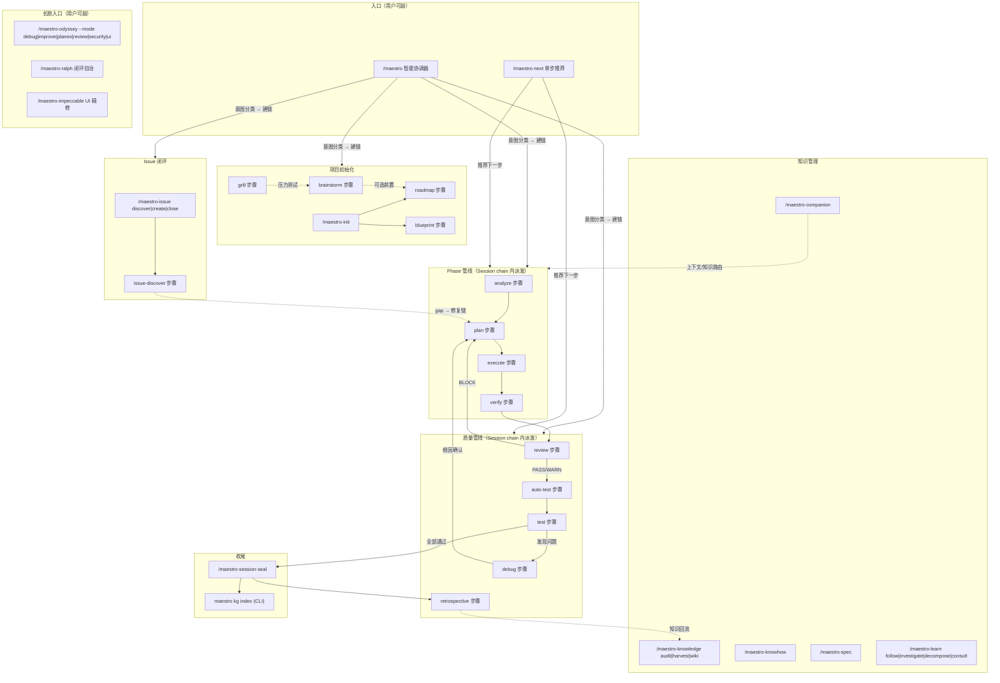
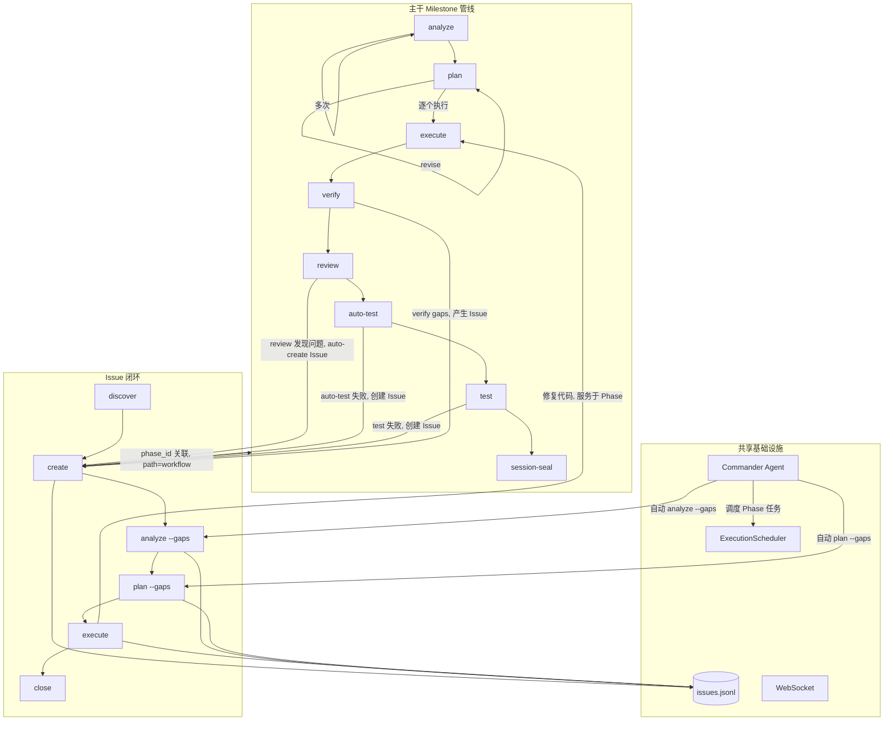

Maestro 命令系统包含 **18 个 slash 命令**，另有由编排器在 Session chain 内派发的一级 step，以及可直接调用的 `team-*`、`skill-*` 等技能（`scholar-*` 为选装，见[学术技能](#十一学术技能scholar-skills选装)）。本文档提供命令全景图和核心工作流导航。

## 命令总览

| 类别 | 命令数 | 命令 | 职责 |
|------|--------|------|------|
| **核心编排** | 6 | `/maestro`、`/maestro-ralph`、`/maestro-next`、`/maestro-companion`、`/maestro-init`、`/maestro-session-seal` | 意图到链规划、闭环策略、路由、轻量执行、项目初始化、Session 封存 |
| **Issue 与知识** | 4 | `/maestro-issue`、`/maestro-knowledge`、`/maestro-knowhow`、`/maestro-learn` | Issue 生命周期与发现；知识存储 audit/harvest/wiki/domain；knowhow 捕获；学习工具集 |
| **规范** | 1 | `/maestro-spec` | 约束规则录入（初始化 `maestro spec init`、加载 `maestro spec load`、移除 step `specs-remove`） |
| **深度循环与 UI** | 2 | `/maestro-odyssey`、`/maestro-impeccable` | 六模式长周期迭代（debug/improve/planex/review/security/ui）；UI 设计与 codify |
| **Worktree** | 2 | `/maestro-fork`、`/maestro-merge` | 创建与合并并行开发 worktree |
| **系统** | 3 | `/maestro-update`、`/maestro-overlay`、`/maestro-guard` | 自更新、命令 overlay、编辑边界 |

除 slash 命令外还有两层，均不以 `/` 开头直接调用：

- **一级 step**（`workflows/`）——`analyze`、`plan`、`execute`、`review`、`test`、`auto-test`、`debug`、`grill`、`brainstorm`、`blueprint`、`roadmap`、`harvest`、`retrospective`、`verify`、`collab` 等，由编排器在 Session chain 内派发，经 `/maestro "<意图>"` 或 `/maestro-next` 触达，不能直接键入形如 `/maestro-…` 的斜杠命令。
- **Skill**（`.claude/skills/`，其中 8 个为 `team-*`）——可直接调用的团队与工具技能，如 `/team-swarm`；另有 `scholar-*` 学术技能族（选装，见后文）。

全局入口 `/maestro` 是**意图到链规划器**，根据用户意图和项目状态自动选择最优命令链。

---

## 命令全景图



---

## 主干与 Issue 的交互关系



### Issue 两种处理路径

| path | 含义 | 来源 | 生命周期 |
|------|------|------|----------|
| `standalone` | 独立 Issue，不绑定 Phase | 手动创建、`/maestro-issue discover`、外部导入 | 独立闭环，不影响 Phase 推进 |
| `workflow` | Phase 关联 Issue | `review` 决策门 auto-create、`auto-test` 失败产生、Phase 验证产生 | 可能阻塞 milestone 完成 |

---

## 一、主干工作流

### 项目初始化

```
/maestro-init → roadmap 或 blueprint（step，经 /maestro 派发）
```

| 步骤 | 命令 / step | 作用 | 产出 |
|------|------|------|------|
| 0 | `brainstorm` 步骤（可选，经 `/maestro`） | 多角色头脑风暴 | guidance-specification.md |
| 1 | `/maestro-init` | 初始化 .workflow/ 目录 | state.json, project.md, specs/ |
| 2a | `roadmap` 步骤 | 轻量路线图 | roadmap.md |
| 2b | `blueprint` 步骤 | 6 阶段规范蓝图 | PRD + 架构文档 + `.workflow/blueprint/` |

### Milestone 管线

```
analyze → plan → execute → verify → review → auto-test → test → session-seal
```

| 阶段 | Skill / 命令 | 产出 | Artifact |
|------|------|------|----------|
| 分析 | `analyze` 步骤 | context.md, analysis.md | ANL-{NNN} |
| 规划 | `plan` 步骤 | plan.json + TASK-*.json | PLN-{NNN} |
| 执行 | `execute` 步骤 | .summaries/, 代码变更 | EXC-{NNN} |
| 验证 | `execute` 内置验证门（E2.7） | verification.json | VRF-{NNN} |
| 封存 | `/maestro-session-seal` | 归档到 milestones/ | — |

**Scope 路由**：无参数 = milestone 全量；数字 = 指定 milestone（micro 模式）；文本 = 宏观探索（macro 模式）。`--dir` 直接指定上游产物路径。

### 双层 Analyze

| 层级 | 参数 | 作用 | 下游路由 |
|------|------|------|----------|
| **Macro（宏观）** | 文本，如 `"用户认证系统"` | 需求影响面探索，产出 scope_verdict | large→roadmap, medium/small→plan |
| **Micro（微观）** | 数字，如 `1` | Milestone 级 6 维度深度分析 | 直接进入 plan |

```bash
# analyze 为 Session chain 步骤，经 /maestro 或 /maestro-next 派发；下列 args 即 chain 内的参数
# Macro：在 roadmap 之前探索需求影响面
analyze "实现多租户架构"           # → scope_verdict: large → 建议 roadmap

# Micro：Milestone 级深度分析
analyze 1                          # → 6 维度评分 → 直接进入 plan

# 传递上游上下文
analyze "认证模块" --from brainstorm:BRN-001
```

### 六种使用模式

**A. 全量模式**：`analyze → plan → execute → verify`（一步覆盖所有 phase）

**B. 逐 Milestone**：`analyze 1 → plan 1 → execute 1`（每个 milestone 独立，micro 层）

**C. 混合模式**：全量分析 + 逐 phase 执行 + 中途 adhoc

**D. 统一规划**：`analyze 1 → analyze 2 → plan → execute`（分析后统一规划）

**E. 独立模式**：`analyze "topic" → plan --dir → execute --dir`（无需 init/roadmap）

**F. 宏观探索**：`analyze "需求描述"` → scope_verdict → roadmap 或 plan（macro 层，roadmap 之前使用）

---

## 二、快速渠道

```bash
/maestro-next "修复登录页面 bug"        # 纯路由：分类意图 → companion / 单 Run / /maestro

# Scratch 模式（无需 init；analyze/plan/execute 为 step，经 /maestro 派发）
analyze "实现 JWT 认证"                 # scope=standalone
plan --dir scratch/20260420-analyze-xxx
execute --dir scratch/20260420-plan-xxx

# Lite 链（探索→规划→执行→测试，由协调器建链）
/maestro "实现 Issue 闭环系统"
```

---

## 三、Issue 闭环

```
发现 → 创建 → 分析 → 规划 → 执行 → 关闭
```

```bash
/maestro-issue discover by-prompt "检查 API 的错误处理"
/maestro-issue create --title "内存泄漏" --severity high
analyze --gaps ISS-xxx                          # 根因分析（step）
plan --gaps                                     # 方案规划（step）
execute                                         # 执行修复（step）
/maestro-issue close ISS-xxx --resolution "Fixed"
```

**Commander Agent** 可自动推进未分析的 Issue，按 `execute > analyze > plan` 优先级调度。

---

## 四、质量管线

```bash
execute → review → auto-test → test → /maestro-session-seal
```

> 注：`auto-test` `review` `test` `debug` 为一级 step，由编排器通过 session chain 派发，用户不直接调用；经 `/maestro-next` 或 `/maestro "<意图>"` 触发。

| 步骤 / 命令 | 用途 | 关键参数 |
|------|------|----------|
| `auto-test` 步骤 | 智能路由测试（spec/gap/code） | `--re-run` `--dry-run` |
| `review` 步骤 | 分层代码审查 | `--level quick\|standard\|deep` |
| `test` 步骤 | 会话式 UAT | `--auto-fix` |
| `debug` 步骤 | 假设驱动调试 | `--from-uat {N}` `--parallel` |
| `/maestro-odyssey --mode improve` | 技术债务治理 | `[scope]` |

**修复循环**：`verify gaps → plan --gaps → execute → verify` 或 `test 失败 → debug → plan --gaps → execute`

---

## 五、协调器命令链

```bash
/maestro "实现用户认证模块"          # 意图识别 → 自动选择命令链
/maestro -y "添加 OAuth 支持"        # 全自动模式
/maestro continue                    # 自动执行下一步
```

| 链名 | 命令序列 | 适用场景 |
|------|----------|----------|
| `full-lifecycle` | init→blueprint→...→session-seal | 全新项目 |
| `roadmap-driven` | init→roadmap→... | 轻量路线图 |
| `brainstorm-driven` | brainstorm→init→roadmap→... | 从头脑风暴开始 |
| `analyze-plan-execute` | analyze→plan→execute | 快速执行 |
| `quality-loop` | review→test→debug | 质量流水线 |
| `milestone-close` | session-seal | 关闭里程碑 |
| `companion` | 即时小任务（`/maestro-companion`） | 即时小任务 |

---

## 六、规范与知识

```bash
maestro spec init                                       # 播种规范骨架文件（不扫描代码库）
maestro run skill specs-setup                            # 已有项目：扫描代码库填充规范
/maestro-spec coding "所有 API 使用 Hono 框架"           # 录入约束规则（首个位置参数即 category）
maestro spec load --category coding                      # 加载规范
maestro kg index                                        # 重建代码库文档
maestro knowhow search "认证"                            # 搜索知识复用
/maestro-knowledge audit --scope all                    # 审计三存储，清理过期/矛盾条目
maestro session status                                  # 项目仪表板
/maestro-companion "实现认证"                            # 轻量执行：加载知识上下文并完成小任务
```

### 新增命令速查

| 命令 / step | 定位 | 使用场景 |
|------|------|----------|
| `/maestro-companion` | 轻量执行 | 最小 Run 生命周期（start + done）+ 证据记录，处理机械清晰的小任务 |
| `/maestro-next` | 单步推荐 | 轻量路由，不创建 session，分类意图后路由到 companion / 单 Run / `/maestro` |
| `grill` 步骤 | 压力测试 | 对抗式苏格拉底访谈，验证方案假设，产出 context-package |
| `blueprint` 步骤 | 正式规格 | 6 阶段文档链（Brief → PRD → Architecture → Epics），与 brainstorm 互补 |
| `/maestro-knowledge audit` | 知识审计 | spec/knowhow/artifact 三存储审计淘汰（keep/deprecate/delete） |
| `/team-swarm` | 蚁群智能 | ACO 驱动群体优化，信息素收敛，4 角色 + Python 控制器 |

---

## 七、奥德赛系列（Odyssey）

学术研究与深度改进工作流，5 个命令覆盖调试、改进、需求实现、代码审查、UI 优化。

### 命令总览

| 命令 | 定位 | 核心流程 |
|------|------|----------|
| `/maestro-odyssey --mode debug` | 深度调试闭环 | 考古 → 探索 → 诊断 → 修复 → 确认 → 泛化 → 发现 → 沉淀 |
| `/maestro-odyssey --mode improve` | 代码库质量提升 | 调查 → 6 维审查 → 诊断 → 修复 → 验证 → 泛化 → 发现 → 沉淀 |
| `/maestro-odyssey --mode planex` | 需求驱动迭代实现 | 解析需求 → 验收标准 → 规划 → 执行 → 验证 → 修复循环 → 泛化 |
| `/maestro-odyssey --mode review` | 深度代码审查 + 修复 | 考古 → 探索 → 多维审查 → 穷尽修复 → 确认 → 泛化 → 发现 → 沉淀 |
| `/maestro-odyssey --mode ui` | UI 视觉体验优化 | 调查 → 6 维审查 → 发散探索 → 修复 → 验证 → 泛化 → 发现 → 沉淀 |

### 共同特征

- **Zero-residual 原则**：每个发现必须有具体动作（修复/创建 Issue/记录决策），不允许"只报告不处理"
- **阶段自动提交**：每个阶段完成后自动 `git commit`，无需用户确认
- **多 CLI 辅助**：通过 `maestro delegate` 调用多个工具交叉验证
- **质量门自迭代**：每个分析阶段自动评估覆盖度/深度/可操作性，不足时重新进入（最多 3 轮）
- **知识沉淀**：S_RECORD 阶段将可复用知识写入 understanding.md，后续通过 `/maestro-spec` 永久化
- **会话可恢复**：`-c` 标志恢复最近会话，`-y` 自动确认所有决策点

### `/maestro-odyssey --mode debug` — 深度调试

```bash
/maestro-odyssey --mode debug "登录接口返回 500"                     # 完整调试闭环
/maestro-odyssey --mode debug "内存泄漏" --template memory-leak       # 预定义策略模板
/maestro-odyssey --mode debug "性能劣化" --skip-fix                   # 仅分析不修复
/maestro-odyssey --mode debug "竞态条件" -y                           # 全自动模式
/maestro-odyssey --mode debug -c                                      # 恢复上次会话
```

| 参数 | 说明 |
|------|------|
| `<issue>` | 问题描述 |
| `--template <name>` | 预定义策略：`performance` / `memory-leak` / `race-condition` / `regression` / `crash` |
| `--skip-fix` | 仅分析，不执行修复 |
| `--skip-generalize` | 跳过泛化扫描 |
| `--auto` | CLI delegate 不需确认 |
| `-y` | 自动确认所有决策 |
| `-c` | 恢复最近会话 |

**输出**：`session.json` + `evidence.ndjson` + `explore.json` + `understanding.md`（9 节）

### `/maestro-odyssey --mode improve` — 代码库质量提升

```bash
/maestro-odyssey --mode improve src/auth/                            # 审查指定模块
/maestro-odyssey --mode improve HEAD                                 # 审查最近变更
/maestro-odyssey --mode improve --dimensions performance,security    # 指定审查维度
/maestro-odyssey --mode improve --all --skip-fix                     # 全项目扫描，仅审查
```

| 参数 | 说明 |
|------|------|
| `<target>` | 模块路径 / `HEAD` / `staged` / 关键词 / `--all` |
| `--dimensions <list>` | 6 维子集：`performance` / `security` / `architecture` / `reliability` / `observability` / `maintainability` |
| `--fix-threshold <severity>` | 修复阈值：`all` / `critical` / `high` / `medium` / `low` |
| `--skip-fix` | 仅审查诊断 |
| `--skip-generalize` | 跳过泛化 |

**6 维审查**：性能（热点路径、N+1 查询）、安全（OWASP Top 10）、架构（层违规、循环依赖）、可靠性（错误处理）、可观测性（日志覆盖）、可维护性（复杂度、死代码）

### `/maestro-odyssey --mode planex` — 需求驱动迭代实现

```bash
/maestro-odyssey --mode planex "实现 JWT 认证"                        # 完整需求闭环
/maestro-odyssey --mode planex "修复登录 bug" --template bugfix       # Bug 修复模板
/maestro-odyssey --mode planex "重构 API 层" --template refactor      # 重构模板
/maestro-odyssey --mode planex "实现支付" --max-iterations 5          # 最多 5 轮验证
/maestro-odyssey --mode planex "迁移数据库" --method cli --executor codex  # CLI 执行
```

| 参数 | 说明 |
|------|------|
| `<requirement>` | 需求描述 |
| `--template <name>` | 模板：`feature` / `bugfix` / `refactor` / `migration` / `api-endpoint` |
| `--max-iterations N` | 验证→修复循环最大次数（默认 3） |
| `--method agent\|cli\|auto` | 执行方式 |
| `--executor <tool>` | 指定 CLI 执行工具 |
| `--skip-verify` | 跳过执行后验证门控 |

**核心循环**：定义验收标准 → 规划 → 执行 → 逐条验证 → 修复失败项 → 重新验证，直到所有标准通过

### `/maestro-odyssey --mode review` — 深度代码审查

```bash
/maestro-odyssey --mode review src/api/                     # 审查指定目录
/maestro-odyssey --mode review HEAD                         # 审查最近变更
/maestro-odyssey --mode review --dimensions correctness,security  # 指定维度
/maestro-odyssey --mode review --fix-threshold high         # 仅修复 critical + high
```

| 参数 | 说明 |
|------|------|
| `<target>` | 文件/目录路径 / `HEAD` / `staged` / Phase 编号 / PR 编号 |
| `--dimensions <list>` | 维度子集：`correctness` / `security` / `performance` / `architecture` |
| `--fix-threshold <severity>` | 修复阈值（默认 `all` = 穷尽所有 severity） |
| `--skip-fix` | 仅审查 |
| `--skip-generalize` | 跳过泛化 |

**穷尽修复**：按 severity 逐轮（critical → high → medium → low），每轮修复后 re-review 修改区域

### `/maestro-odyssey --mode ui` — UI 视觉体验优化

```bash
/maestro-odyssey --mode ui src/components/Header/                    # 审查指定组件
/maestro-odyssey --mode ui --dimensions visual_hierarchy,accessibility  # 指定维度
/maestro-odyssey --mode ui --skip-fix                                # 仅审查 + 发散探索
```

| 参数 | 说明 |
|------|------|
| `<target>` | 组件/页面路径 / `staged` / `HEAD` / 功能区域名 |
| `--dimensions <list>` | 6 维子集：`visual_hierarchy` / `interaction_states` / `accessibility` / `responsiveness` / `micro_interactions` / `edge_cases` |
| `--skip-fix` | 仅审查 |
| `--skip-generalize` | 跳过泛化 |

**独特阶段**：S_DIVERGE（发散探索）— 超越缺陷修复，探索"什么会让这个界面令人愉悦？"

---

## 八、Ralph 生命周期引擎

Ralph 是自适应生命周期引擎，读取项目状态 → 推断位置 → 构建自适应步骤链 → 委托执行。

### `/maestro-ralph` — 自适应决策引擎

```bash
/maestro-ralph "实现用户认证"                          # 自动推断位置并构建链
/maestro-ralph "phase 2"                              # 指定 phase
/maestro-ralph status                                 # 查看当前会话状态
/maestro-ralph continue                               # 恢复执行
/maestro-ralph -y "重构 API 层"                       # 全自动模式
```

**核心不变量**：
- Session/Run/Artifact/Evidence protocol 是唯一真源
- Ralph policy 负责 proposal 评价、budget、confidence、escalation 与停止条件
- `run-executor` 每次只执行一个 Skill Run，不 complete、不推进 chain
- Skill 只能提出 typed proposal，Runtime 独占 mutation authority

**决策门控**：post-execute / post-business-test / post-review / post-test / post-goal-audit / post-analyze-scope / post-milestone — 自动评估质量门结果，决定 proceed / fix / escalate

### `run-executor` — 通用单 Run 执行器

```bash
maestro run next --session <session-id>               # 分配下一条 chain Run
maestro run brief <run-id> --session <session-id>     # 加载 canonical Resume Packet
```

`run-executor`：`run next/brief` → 内联执行一个 Skill → `run check` → 返回 Artifact/proposal。外层 `/maestro-ralph` 评价 proposal，并通过 `maestro run complete --verdict [--chain-proposal]` 收口；只有下一次显式 `run next` 才分配后续 Run。

---

## 九、缺失 maestro-* 命令补充

### `/maestro-overlay --amend` — 工作流缺陷修复

```bash
/maestro-overlay --amend --scan                                 # 自动扫描 .workflow/ 发现信号
/maestro-overlay --amend --from-verify .workflow/scratch/xxx    # 从验证结果收集信号
/maestro-overlay --amend --from-review .workflow/scratch/xxx    # 从代码审查收集信号
/maestro-overlay --amend --from-issues ISS-001,ISS-002          # 从 Issue 收集信号
/maestro-overlay --amend "execute 后缺少验证步骤"                # 直接描述缺陷
```

信号驱动的 overlay 生成器 — 从多个来源收集工作流缺陷信号，诊断哪些命令需要修补，批量生成定向 overlay。与 `/maestro-overlay`（单个显式意图）不同，此命令**发现**需要修补的内容。

### `collab` 步骤 — 多工具交叉验证

`collab` 是 Session chain 步骤，经 `/maestro` 派发（链内 `{"command": "collab", "args": "..."}`）；下列 args 为链内参数：

```bash
collab "评估微服务拆分方案"                    # 多工具并行分析
collab "审查安全架构" --tools gemini,claude    # 指定工具
collab "API 设计评审" --mode analysis          # 只读分析模式
```

将需求扇出到多个 CLI 工具并行执行 → 交叉验证共识/冲突 → 合成统一报告（collab-report.md + context.md + conclusions.json）。

### `/maestro-fork` — Milestone Worktree 并行开发

```bash
/maestro-fork -m 2                                    # 为 Milestone 2 创建 worktree
/maestro-fork -m 2 --base develop                     # 指定基础分支
/maestro-fork -m 2 --sync                             # 同步主分支最新变更
```

创建或同步 milestone 级 git worktree 用于并行开发。自动复制共享 `.workflow/` 文件，写入 scope marker 和 scoped state.json。

### `/maestro-merge` — Milestone Worktree 合并

```bash
/maestro-merge -m 2                                   # 合并 Milestone 2 worktree
/maestro-merge -m 2 --dry-run                         # 预览合并
/maestro-merge -m 2 --no-cleanup                      # 合并但保留 worktree
/maestro-merge -m 2 --continue                        # 解决冲突后继续
```

将 milestone worktree 分支合并回主分支，同步 scratch 产物，协调 artifact registry。两阶段：git merge 优先，artifact sync 其次。

### `/maestro-guard` — 编辑边界管理

```bash
/maestro-guard on                                     # 启用边界保护
/maestro-guard off                                    # 禁用
/maestro-guard status                                 # 查看状态
/maestro-guard allow src/                             # 允许编辑 src/ 目录
/maestro-guard deny node_modules/                     # 禁止编辑 node_modules/
```

配置目录级写入边界，由 `workflow-guard` PreToolUse hook 强制执行。

### `/maestro-overlay` — 命令 Overlay 创建

```bash
/maestro-overlay "execute 后总是运行 review"            # 从自然语言创建 overlay
/maestro-overlay "analyze 前加载领域知识"               # 注入 required_reading
```

将自然语言指令转换为命令 overlay — JSON patch 文件，非侵入式增强 `.claude/commands/*.md`。支持注入点预览、skill chain 配置、幂等安装。管理通过 `maestro overlay list`（ink TUI）。

### `/maestro-impeccable --codify` — 设计系统提取

```bash
/maestro-impeccable --codify src/components/                    # 从源码提取设计系统
/maestro-impeccable --codify src/ --package-name my-design      # 指定包名
/maestro-impeccable --codify src/ --output-dir .workflow/ref    # 指定输出目录
```

4 阶段流水线：验证 → 提取（3 个并行 Agent）→ 打包（preview.html）→ 知识资产持久化。输出 design-tokens.json + layout-templates.json + preview + knowhow manifest。

### `/maestro-update` — 版本升级

```bash
/maestro-update                                       # 检测并升级
/maestro-update --dry-run                             # 预览升级计划
/maestro-update --force                               # 跳过确认
/maestro-update --setup-only                          # 仅运行当前版本 setup
```

检测当前版本 → 运行 schema migration → 执行版本特定升级工作流。自动备份 state.json，支持增量迁移。

---

## 十、CLI 子系统

### `maestro install toggle` — 命令启用/禁用

```bash
maestro install toggle                                # 交互式 TUI
maestro install toggle --type command                  # 仅管理命令
maestro install toggle --list                         # 列出所有已安装项
maestro install toggle --enable "maestro-ralph,maestro-search"   # 启用指定项
maestro install toggle --disable "team-swarm,team-review"        # 禁用指定项
```

提供交互式 TUI 和非交互式 CLI 两种方式，管理已安装的命令、技能和代理的启用状态。

### `maestro workspace` — 工作空间管理

```bash
maestro workspace link <path>                         # 链接外部工作空间
maestro workspace unlink <path>                       # 取消链接
maestro workspace list                                # 列出所有链接的工作空间
maestro workspace status                              # 查看工作空间状态
```

管理多项目工作空间链接，支持跨项目知识共享和 artifact 引用。

### `maestro domain` — 领域知识管理

```bash
maestro domain                                        # 查看当前领域配置
```

管理项目领域知识配置，影响 spec 注入和知识搜索的范围。

### `/maestro-knowledge extractors` — 知识图谱提取器配置

```bash
/maestro-knowledge extractors                                 # 扫描并生成提取规则
/maestro-knowledge extractors --scan-only                     # 仅扫描不写入
/maestro-knowledge extractors --append                        # 追加到现有配置
/maestro-knowledge extractors --language typescript            # 限定语言
```

分析代码库模式，自动生成 `.workflow/kg/extractors.yaml` — 教 MaestroGraph 的 codegraph 提取器识别项目特定符号（builder/factory API、领域常量、自定义装饰器等）。3 个并行 Agent 扫描 builder/factory 调用、常量/注解、框架特定模式。

### `store_knowhow` MCP 工具

`store_knowhow` 是 MCP 内置工具，用于知识条目的存储和搜索：

| 操作 | 说明 |
|------|------|
| `add` | 创建新 knowhow 条目（type: session/tip/template/recipe/reference/decision/asset/blueprint/document） |
| `search` | 全文搜索 knowhow 条目 |

条目自动由 WikiIndexer 索引（type=knowhow, category={type}）。支持标签、分类、spec category 桥接（`specCategory` 参数允许 knowhow 条目与 spec 条目一起注入）。

---

## 十一、学术技能（Scholar Skills）— 选装

10 个学术研究技能，覆盖从构思到发表的全流程。**选装（默认不安装）**：源码位于 `optional/skills/`，不在默认镜像与 `.claude/skills/` 中。按需安装：

```bash
maestro install toggle --enable scholar-writing,scholar-review   # 安装指定技能到当前项目
maestro install toggle --list                                     # 查看 available 状态的选装技能
```

| 技能 | 定位 | 触发词 |
|------|------|--------|
| `scholar-ideation` | 研究构思与文献综述 | brainstorm research ideas, identify research gaps |
| `scholar-experiment` | 实验结果分析 | analyze experimental results, statistical analysis |
| `scholar-writing` | 端到端论文写作 | write paper, draft paper |
| `scholar-review` | 论文自审与审稿回复 | review paper, write rebuttal |
| `scholar-rebuttal-pro` | 增强审稿回复（多视角） | rebuttal, respond to reviewers |
| `scholar-citation-verify` | 引用验证（4 层验证） | verify citations, check references |
| `scholar-anti-ai-writing` | 去除 AI 写作痕迹 | remove AI patterns, humanize text |
| `scholar-latex-organizer` | LaTeX 模板整理 | organize LaTeX template, prepare Overleaf |
| `scholar-publish` | 录用后会议准备 | conference preparation, prepare presentation |
| `scholar-thesis-docx` | 学位论文 Word 排版 | thesis formatting, dissertation Word |

---

## 专题指南

| 专题 | 指南 |
|------|------|
| 质量管线详细说明 | [Quality Pipeline Guide](./quality-pipeline-guide.md) |
| Issue 发现与闭环 | [Issue Discover Guide](./issue-discover-guide.md) |
| 学习工具集 | [Learn Tools Guide](./learn-tools-guide.md) |
| 知识图谱管理 | [Knowledge Management Guide](./knowledge-management-guide.md) |
| 搜索系统 | [Search System Guide](./search-system-guide.md) |
| 安装指南 | [Install Guide](./install-guide.md) |
| CLI 命令参考 | [CLI Commands Guide](./cli-commands-guide.md) |
| Spec 规范系统 | [Spec System Guide](./spec-system-guide.md) |
| Spec 注入机制 | [Spec Injection Guide](./spec-injection-guide.md) |
| MCP 工具参考 | [MCP Tools Guide](./mcp-tools-guide.md) |
| Delegate 异步委托 | [Delegate Async Guide](./delegate-async-guide.md) |
| Overlay 命令扩展 | [Overlay Guide](./overlay-guide.md) |
| Hooks 自动化 | [Hooks Guide](./hooks-guide.md) |
