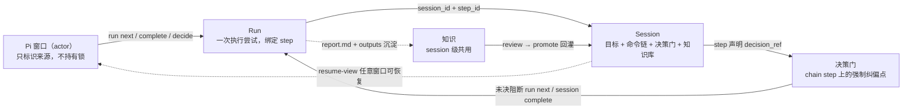
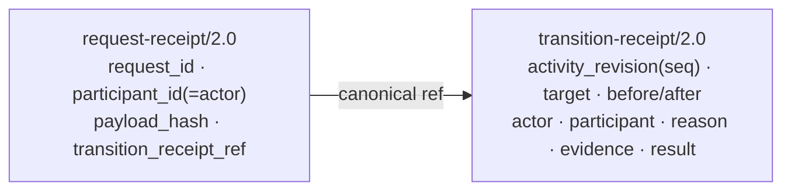
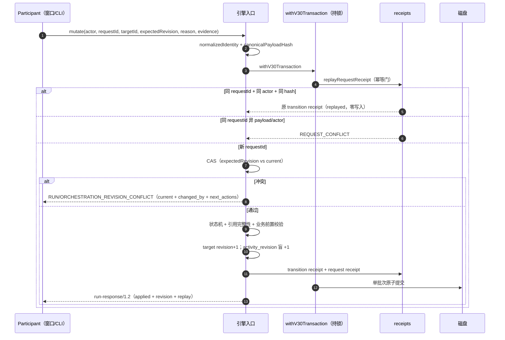
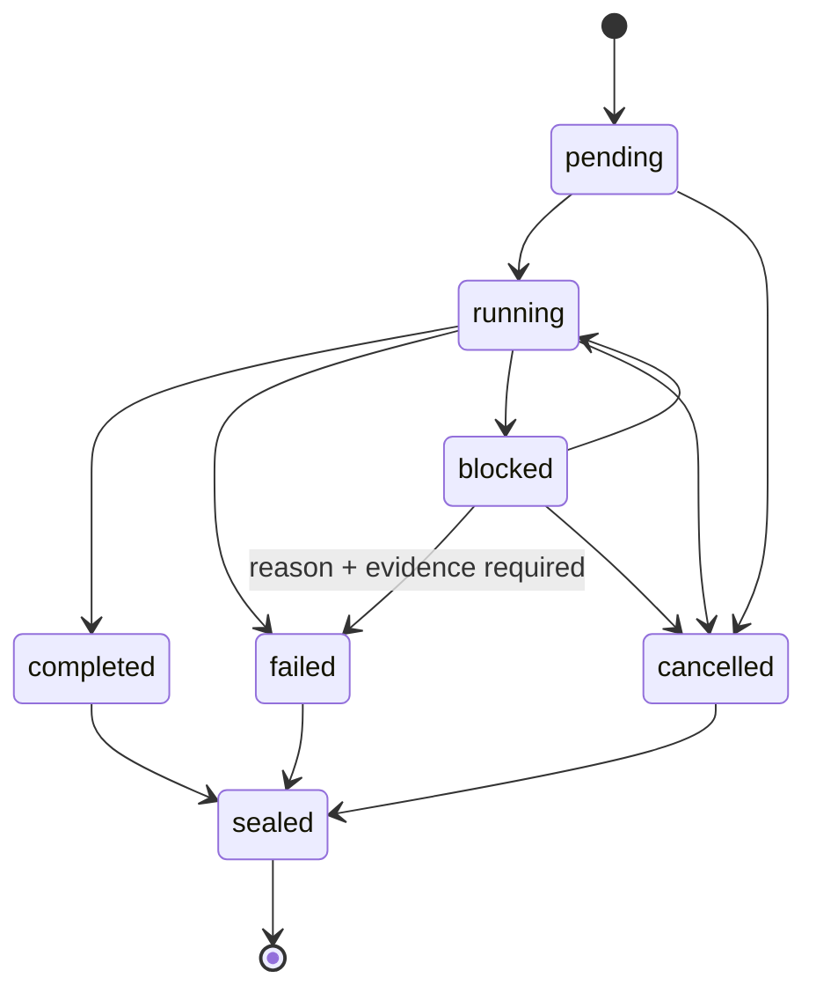
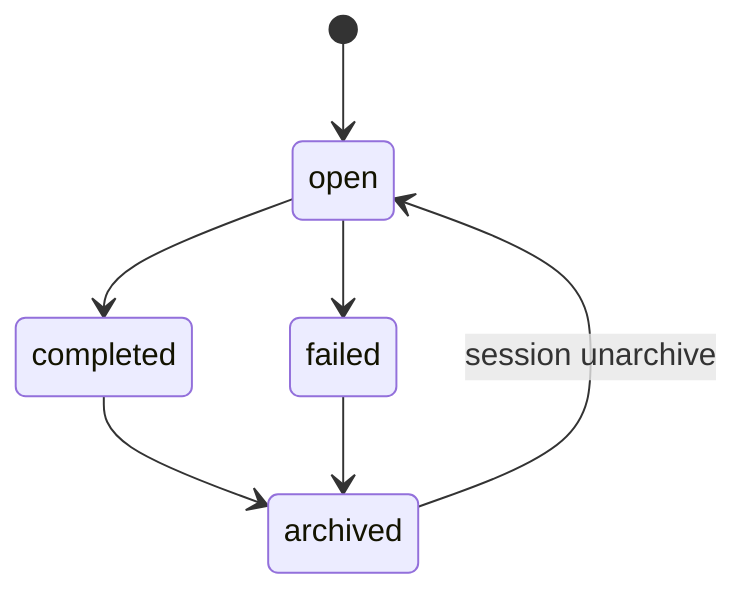
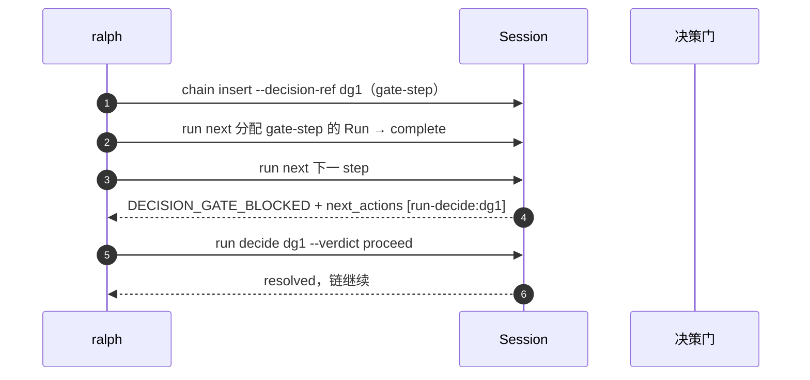
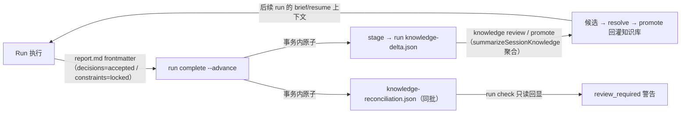

# Session/Run v3 架构参考设计（Reference Design）

> 版本基线：maestro-flow `0.5.73`（release commit `9d97a7df`，参考设计状态 commit `695ee537`，tag `v0.5.73`）+ pi-maestro-flow `0.21.4`（commit `9ee5edbe`），2026-08-14 发布。
> 本文是 v3 的**权威参考设计**：概念模型、数据模型、协议、mutation 引擎、状态机、决策门、并发语义、迁移与知识流的完整描述。实现细节以源码为准，本文给出设计意图与约束。
> 上游文档：方案 B（`session-run-minimal-state-architecture-20260812.md`）、合同清单（`session-run-v3-core-contract-checklist-20260812.md`）、实现蓝图（`session-run-v3-implementation-blueprint-20260812.md`）、简化规划（`session-run-v3-simplified-plan.md`）、当前架构审计（`session-run-v3-current-architecture-audit.md`）。

## 1. 设计目标与原则

### 1.1 目标

v3 是 Session/Run 的「最小状态」架构，取代 v2 的 Execution + lease 时代：

1. **ralph 命令端到端跑通**是唯一验收锚点：`session open --chain` → `run next` → `run complete --advance` → `run decide` → `session complete` → `session archive` + 知识流。
2. **保留多窗口并发正确性**：多个 Pi 窗口/agent 可同时读写同一 Session，无需 attach/lease/handoff。
3. **概念最小化**：Session（容器）、Run（执行）、决策门（纠偏）、知识（沉淀）四个概念；一切 ralph 路径不触碰的复杂度从核心移除或冻结。

### 1.2 核心不变量

| # | 不变量 | 含义 |
|---|---|---|
| 1 | 每次写操作一次原子事务 | revision CAS → 状态机校验 → 写实体/registry → 写双 receipt → 单批次提交 |
| 2 | `activity_revision` 盲递增 | 事件序号，永不参与 CAS、不作为冲突来源、不可作为 mutation target |
| 3 | Run 是独立并发边界 | 不同 Run 独立文件 + 独立 revision，天然并行；同 Run 冲突由 `RUN_REVISION_CONFLICT` 可见可恢复 |
| 4 | 幂等窗口 = Session 生命期 | `requestId + actor + canonical payload hash` 一致即 replay 原 receipt，不重复写 |
| 5 | 双读单写 | 新 CLI 读 v1/v2/v3，只写 v3；旧 CLI 对 v3 fail-closed（`SESSION_SCHEMA_UNSUPPORTED`） |
| 6 | 决策门是强制纠偏点 | 未决决策门阻断 `run next`/`session complete`，escalated 以 concerns 通过 |
| 7 | 审计权威 = transition receipt | immutable、全序（activity revision 为 seq）、含 actor/participant/reason/evidence/前后 revision |

### 1.3 版本演进（v1.3 → v2.0 → v3）

| 代际 | 模型 | 状态 |
|---|---|---|
| session/1.x | 全量文档 + ralph-meta | 读兼容（normalization 升格） |
| session/2.0 + execution/1.0 | statusless Session + Execution 实体 + lease | **Legacy compatibility**（读/写保留；既有 workspace 保持已存 writer；可用 `config session-schema set 1.3|2.0` 显式选择） |
| session/3.0 + run/3.0 | 最小状态：Session 容器 + Run 执行 + receipt + 决策门 | **Canonical 默认**（0.5.73 起新 workspace 默认 writer） |

## 2. 概念模型



| 概念 | 本质 | 关键字段 |
|---|---|---|
| 窗口 | 谁在做事（审计） | `actor_id`（participant 已退役，`--participant` 仅兼容接收） |
| Session | 容器：目标 + 链 + 决策门 + 知识 | `orchestration_revision`（CAS）、`chain[]`、`status` |
| 决策门 | step 完成后的强制判定 | step `decision_ref` + `decisions[]` 状态 |
| Run | 链上执行 | `session_id`、`step_id`、`revision`（CAS）、`status` |
| 知识 | run 沉淀 → session 治理 | report.md frontmatter → 候选 → promote |

关系只有两条：**run 挂在 chain step 上**；**决策门挂在 step 上并阻断推进**。

## 3. 数据模型（session/3.0 最终形态）

### 3.1 Session（`sessionStateV30Schema`）

```
session_id / objective / definition_of_done
status: open | completed | archived | failed        // paused 已移除
orchestration_revision                               // CAS target（chain/decision/status）
activity_revision                                    // 盲递增事件序号（receipt seq 来源）
chain[] / decisions[]
artifacts_ref / evidence_ref                         // gates_ref 已移除
created_at / updated_at / completed_at / archived_at
```

**Revision 语义**（三 revision → 两 revision）：

| Revision | 用途 | CAS target |
|---|---|---|
| orchestration | chain、decisions、Session 状态 | ✅ |
| activity | 事件序号、receipt 路径 seq、resume fingerprint | ❌ 盲递增 |

### 3.2 Chain step

```
step_id / command / args / status(pending|running|completed|failed|skipped)
goal_ref / stage / decision_ref: string | null      // 决策门声明（可空）
```

- `command/args` 是 step 的执行声明；Run 创建时**快照**到 Run 文档（step 被 `chain replace` 改写后历史 Run 不变——审计需要）。
- `decision_ref` 声明本 step 完成后必须过的决策门；`chain insert --decision-ref <id>` 写入时同时在 `decisions[]` 建 `open` 记录。

### 3.3 Run（`runV30Schema`）

```
run_id / session_id / step_id
parent_run_id / retry_of_run_id / attempt             // parent 为一般/兼容谱系；retry_of + attempt 为重试谱系
command / args / goal（创建时快照）
status / revision                                    // revision 为 per-Run CAS target
actor_id                                             // participant_id 已移除
output_refs / primary_artifact_id
verdict: done | done_with_concerns | needs_retry | blocked | null
summary / created_at / started_at / ended_at / sealed_at
```

### 3.4 Decisions

```
decision_id / after_step_id / status(open|resolved|escalated) / evidence_refs
```

- `proceed/fix` → `resolved`；`escalate` → `escalated`（**不暂停 Session**）。
- 决策语义（verdict/confidence/summary）完整保留在 transition receipt 的 immutable result 中。

### 3.5 Receipt（审计与幂等双职责）



- `participant_id` 字段保留但恒等于 `actor_id`（批次 B 后）。
- 幂等键 = `requestId + participant_id(=actor) + payload hash`。
- request receipt 只存 hash + 引用（有界）；transition receipt immutable，12 位 activity revision 提供全序。
- 保留策略：Session 生命期；archived 后随 Session 归档。

### 3.6 存储布局

```text
.workflow/
  config.json                     # session_schema.writer（config session-schema set/show 切换）
  sessions/
    .session-store.lock
    <session-id>/
      session.json                # session/3.0
      runs/<run-id>/run.json      # run/3.0 + outputs/evidence/work/report.md/diagnostics.ndjson
      receipts/requests/<request-id>.json
      receipts/transitions/<seq>-<transition-id>.json
      artifacts.json / evidence.json
      knowledge-reconciliation.json（run 级，v2 同路径）
      v3-migration-report.json + legacy-v2-snapshot/<id>/（迁移后只读）
```

## 4. 协议

### 4.1 Capabilities（maestro-capabilities/1.0）

v3 workspace（writer=session/3.0）广播：

```json
{
  "session_schema_writes": ["session/3.0"],
  "execution_schema_writes": [],
  "run_response_writes": ["run-response/1.0", "run-response/1.1", "run-response/1.2"],
  "features": {
    "session_run_minimal_v3": true, "entity_revision_cas": true,
    "participant_identity": true, "request_receipts_v2": true,
    "execution_lease": false, "operation_registry": false,
    "execution_generation": false, "core_execution_lease": false,
    "execution_handoff": false, "session_statusless": false,
    "legacy_session_aliases": false,
    "artifact_compatibility_v1": true, "atomic_run_complete_seal": true,
    "generation_scoped_seal_receipts": true
  }
}
```

- `session_schema_writes` **writer-scoped**（严格声明，非功能矩阵）；`participant_identity` 键保留 true（六键协商不变，语义 = actor 身份注入）。
- features schema 为「已知键 + 布尔 catchall」，旧 CLI 解析不崩。

### 4.2 run-response/1.2

- 单行 JSON + exit code parity；`revision`（target_type/target_id/revision）与 `replay`（applied/replayed + transition_id）顶层字段。
- 错误统一结构化：`code / message / retryable / details / target_type / target_id / expected_revision / current_revision / changed_by / next_actions`。
- 核心错误码：`RUN_REVISION_CONFLICT`、`ORCHESTRATION_REVISION_CONFLICT`、`REQUEST_CONFLICT`、`SESSION_AMBIGUOUS`、`SESSION_SCHEMA_UNSUPPORTED`、`INVALID_STATE_TRANSITION`（含 `DECISION_GATE_BLOCKED` reason）、`STORE_BUSY`（锁超时映射，retryable）。

### 4.3 命令面（v3 正式面）

| 族 | 命令 |
|---|---|
| capabilities | `capabilities --json` |
| config | `config session-schema set/show`（writer 切换） |
| session | open（`--chain` 初始化链）、migrate（`--to-v3`）、complete、archive、list、status、resume-view、chain insert（`--decision-ref`）/skip/replace |
| run | next、create、complete（`--advance` 必选）、transition、cancel、seal（恢复）、decide、recall（冻结）、brief、check |
| artifact | inspect、republish（冻结） |
| execution | 全族 retired 壳（结构化 replacement，不模拟） |
| knowledge | promote / review / stage（知识治理） |

统一 mutation options：`--participant`（兼容忽略）`--actor --request-id --reason --evidence --expected-run-revision|--expected-orchestration-revision --json`。**不暴露** `--expected-activity-revision`。

机器模式：`--json` + v3 writer + 子命令白名单（decide/recall/list 已同步）；fatal 错误 envelope operation 推断与命令注册一致。

## 5. Mutation 引擎

### 5.1 十步事务流程

所有 mutation 收敛到 `store.withV30Transaction(sessionId, builder)`：全局短锁 → builder 内校验/组装 → `pendingWrites()` 单批次原子提交（intent journal + 临时文件 + safeRename + 崩溃恢复）。



锁序：先 target 校验，后 Session 计数器递增（引擎内固定逻辑顺序）；全局单文件锁是全序，无死锁。

### 5.2 引擎入口

| 入口 | 事务内动作 | CAS target |
|---|---|---|
| `mutateRunV3` | Run 状态迁移（running/blocked/failed/cancelled），联动 chain step 与 active_run_ids | run |
| `createRunV3` | 创建 pending Run + chain step run_ids | orchestration |
| `createRunningRunV3` | run next/create：创建并启动（running, rev=1）+ chain step → running + 前驱发布权/决策门校验 + 消费者 input 注入 | orchestration |
| `completeRunAndAdvance` | 复合事务：completed→sealed + 产物注册 + chain step → completed + 知识候选生成 | run + orchestration |
| `recoverSealRunV3` | 迁移后恢复封存（terminal Run 补发布权） | run |
| `republishArtifactV3` | artifact 兼容重发布（冻结保留） | artifact + orchestration |
| `completeSessionV3` | Session → completed（blocking 校验 + 决策门校验） | orchestration |
| `mutateChainV3` | chain insert/skip/replace（skip 需 evidence） | orchestration |
| `decideV3` | decision upsert + 链关联 + escalate 语义 | orchestration |

### 5.3 复合事务：`run complete --advance`

- 单事务完成：Run completed→sealed + artifact 扫描/契约校验/注册 + chain step → completed + active_run_ids 移除 + 知识候选生成。
- `--summary` 省略时从 `report.md` frontmatter 回退（ralph 路径单一输入通道）。
- **不分配下一 Run**：返回 `next{suggest_only: true, command: 'run next ...'}`；下一 Run 只由显式 `run next` 创建。
- 失败路径：`run transition <id> failed` → `run create --retry-of-run <id>`（attempt+1）；`blocked` 是 Run 状态，**永不暂停 Session**。

## 6. 状态机

### 6.1 Run



- `blocked → failed` 必须附非空 reason + ≥1 evidence。
- retry = 新建 Run（`retry_of_run_id` + attempt+1）；源必须 failed（或 sealed 且 verdict ∈ {needs_retry, blocked}）；failed/sealed 不得改回 running。

### 6.2 Session



`paused` 已移除——**决策门 escalated 完全替代暂停语义**。`archived` 禁止创建 Run 或修改 chain，只允许显式 `session unarchive` 回到 `open` 后继续。操作权限：

| Session | create/advance | transition existing Run | decide | evidence | archive mutation |
|---|---|---|---|---|---|
| open | ✅ | ✅ | ✅ | ✅ | ❌ |
| completed/failed | ❌ | ❌ | ❌ | ❌ | `session archive` |
| archived | ❌ | ❌ | ❌ | ❌ | `session unarchive` → open |

`session complete` 前置校验（事务内从锁定权威推导）：无 running Run、全部 chain step completed/skipped 带依据、**无 open 决策门**（escalated 以 `concerns` 通过并记录）。

## 7. 决策门（v3 核心新增）

### 7.1 设计动机

v3 早期决策是「软记录」：chain step 无决策门声明、`run next` 不查未决决策、`session complete` 也不查——长期命令链没有纠偏装置。决策门把「决策点辅助纠正」变为强制结构，与 ralph Stage Mapping 的 decision gates（post-analyze-scope 等）一一对应。

### 7.2 语义

| 环节 | 规则 |
|---|---|
| 声明 | `session chain insert --decision-ref <id>`（或 step 的 `decision_ref` 字段）；同时写入 `decisions[]` open 记录 |
| 阻断 | `run next`/`run create`：前驱 step completed 且带 `decision_ref` 且对应决策 open/escalated → `INVALID_STATE_TRANSITION`（`DECISION_GATE_BLOCKED`），`next_actions: ['run-decide:<point>']`（escalated 追加 `review-escalated-decision:<point>`）；skipped 前驱不阻断；**缺失决策记录按 open 处理** |
| 解决 | `run decide <point> --verdict proceed\|fix` → resolved（链继续）；`--verdict escalate` → escalated（仍阻断，处置 = 再次 decide 覆盖或 complete 时以 concerns 通过） |
| 终局 | `session complete`：open 门阻断；escalated 门通过但记入 result `concerns` |
| 恢复 | `session resume-view` 的 `openDecisions` 直接列出未决决策门 |



## 8. 多窗口并发语义

1. **写同一 Run 才需要 CAS**；不同 Run 天然并行（独立文件 + 独立 revision，仅在 Session 计数器递增处毫秒级串行化）。
2. **窗口关闭不释放任何资源**——run 保持 running，其他窗口照常读写；无 heartbeat/lease/handoff。
3. **冲突可见可恢复**——`RUN_REVISION_CONFLICT` 带 current_revision/changed_by/next_actions；失败方重新读取重新评估意图，core 不自动换 revision 重放。
4. 任意窗口 `session resume-view` 恢复上下文；participant 身份仅审计（注册/注销命令已退役，`--participant` 值被忽略）。

## 9. Resume View（ResumeMapV1）

```ts
interface ResumeMapV1 {
  sessionId; sessionStatus;
  orchestrationRevision; activityRevision;        // identityRevision 已并入 orchestration
  activeRuns: Array<{ runId; stepId; status; revision }>;  // 稳定排序
  blockingGates: string[];                        // 恒空（gates 系统已移除，协议字段保留）
  openDecisions: string[];                        // 未决决策门
  pendingPublications: Array<{ publicationId; resourceUri? }>;
  nextActions: Array<{ action; targetId; expectedRevision }>;
  fingerprint: string;                            // sha256(canonical(map minus fingerprint))
}
```

硬约束：strict schema + 深度禁词守卫（execution/lease/operation/generation 字段名拒绝输出）；序列化 ≤2048 UTF-8 字节，**超限抛错**（不截断——简化后 ralph 场景 map 远小于 2KB）。

## 10. 知识流（session 级共用 + run 沉淀）



- **候选生成与 staging 原子化**（0.5.72 修复）：`run complete --advance` 事务内把 frontmatter 事实（accepted decisions / locked constraints）通过 `stageV3RunKnowledgeCandidates` 写入 run `knowledge-delta.json`（v2 同路径），reconciliation receipt 同批提交——对账与 staging 不可能分叉；suppression（exact_duplicate）同步生效。
- **promote 可见性**（0.5.72 修复）：`summarizeSessionKnowledge` 以 schema 无关方式枚举 run（`readRunRecord*`），v3 workspace 下 `knowledge review/promote` 可见 v3 候选（origin=run、pending）并正常 resolve/promote。
- `run check` 只读回显已持久化 receipt（review_required 警告）。
- promotion 后知识进入 workspace 知识库，供后续 Run 的上下文使用——「run 过程中知识积累、session 共用」完整闭环。

> 历史缺陷（0.5.71 及之前）：v3 只生成 receipt 不 stage，且 summarizeSessionKnowledge 对 run/3.0 抛 `SessionSchemaUnsupportedError`——候选永远无法进入 review/promote。已修复。

## 11. 迁移（v2 → v3）

| 步骤 | 动作 |
|---|---|
| 1 | 冻结旧 Session/Execution/Run 快照 + sha256 清单（`legacy-v2-snapshot/<id>/`，只读） |
| 2 | 投影 session/3.0（status：paused → open；identity_revision 丢弃；gates 只进快照） |
| 3 | 每个旧 Run 补 sessionId/stepId/attempt/revision/actor fallback |
| 4 | execution generation → `legacy_execution_generation` 审计字段 |
| 5 | finalOutcome/seal summary → Session transition receipt |
| 6 | 丢弃 lease/heartbeat/handoff/operation token（报告只记 hash 与原因） |
| 7 | 引用完整性验证（Run/Artifact/Evidence） |
| 8 | `withV30Transaction` 原子发布；`v3-migration-report.json` |

约束：有 running Run 的旧 Session 拒绝迁移；迁移 receipt `participant_id = actor_id`；旧 CLI 对 v3 mutation fail-closed；禁止 dual-write。

## 12. 兼容与退役

| 面 | 状态 |
|---|---|
| v2（session/2.0 + execution/1.0） | Legacy compatibility 完整保留（读/写）；既有 workspace 保持已存 writer，新 workspace 默认 session/3.0；`config session-schema set 1.3|2.0` 为显式逃生口 |
| 旧 v3 文件（含 identity_revision/paused/gates_ref/participant_id/gate_refs） | **strip 宽容读 schema**：读时剥离退役字段、`paused`→`open` 映射；引擎重写后文档不再含退役字段 |
| participant 命令族 | 已删除；`--participant` option 兼容接收（值忽略） |
| session pause/resume、chain audit、session fail | 已删除 |
| chain-proposal、TC-P0-3 附加输入、retired stubs、resume-map 截断、mutations.jsonl | 已删除（审计权威 = transition receipt） |
| artifact republish、run recall | 兼容保留：artifact republish 仍由 Pi v3 通过 orchestration revision CAS 消费；run recall 保持只读，不扩展新的 authority 语义 |
| execution 命令族 | retired 壳（结构化 replacement，不模拟） |

## 13. 测试与验收

- Core 发布验收：`prepublishOnly` 全绿；release-machine 30 proofs、contract parity 41 checks、`build:mirrors` 与 v3 prompt lint 全部通过。
- Core 全量 Vitest：1104/1109 通过；剩余 5 个为既有基线（run-context×2、built-bin check、wiki-live、complete-verdict），stash 对照确认非 v3 收敛引入。
- Pi 发布验收：session/CLI v3 集成 113 通过、1 跳过，typecheck 0 错误，`test:package` 18/18 通过；此前 4 个 v2 real-CLI fixture 失败已随 v3 fixture 迁移消除。
- 真实跨仓 E2E 已通过：全新 v3 workspace + 真实 core CLI 完成 open→insert→next birth→brief→check→complete --advance→decide→session complete→resume-view→knowledge review；同时验证 stale CAS 拒绝/重试、response-loss replay 和双进程同 revision 竞争仅分配一个 Run。
- 剩余测试工作仅为自动化补强：pack/install 隔离 HOME 冒烟、compaction reattach 专项用例；不阻断 0.5.73/0.21.4 功能交付。

## 14. 实现符合性审查（2026-08-14 复核）

结论：Session/Run v3 已完成 canonical 收敛并发布。maestro-flow 0.5.73 默认写 session/3.0，Pi 0.21.4 的 executor/coordinator/knowledge 路径已消费 v3 birth/brief 和无 lease CAS；v2 Execution/lease 仅保留在明确标注的 Legacy compatibility branch。功能交付门槛已闭合，剩余事项仅为测试自动化补强与 legacy migration 风险跟踪。

### 14.1 已确认修复

- `run create` 已统一执行前驱 publication authority 校验；Run shell 在 mutation 提交前创建；replay candidate 会清除引擎注入的 `input_refs`。
- transition receipt 写路径强制 `participant_id = actor_id`；migration 已补 request receipt；`--participant` 仅兼容接收，不再参与幂等身份。
- core ResumeMap 已删除 `identityRevision` 和 `paused`；禁词检查会拒绝任意 execution 字段；resolved/escalated decision 不再能绑定为新 gate。
- `run next` 缺省 Run ID 已改为从 request ID 确定性派生，响应丢失后使用同一 request ID 可 replay 原 mutation。
- Pi `next/done` 已委托 `execV3` 的无 lease CAS 路径，`edit` 在 v3 下显式拒绝并指引 `session chain insert|skip|replace`；artifact republish 使用 canonical orchestration revision flag。
- Pi v3 capability 选择、response operation/request 绑定、strict ResumeMap、bridge decisions/retry lineage 与 run-control operation 面已同步最终 core 合同。

### 14.2 收敛状态与残余跟踪

| 状态 | 项目 | 当前证据与影响 |
|---|---|---|
| ✅ 已完成 | v3 birth packet | `8ffb8b0a`（0.5.73）：`run next/create` result 含 `run_dir`、`step_id`、`upstream`、guidance snapshot、`knowledge_context`、`brief.command` 与 `run_already_created`；同 request replay 返回相同 packet。 |
| ✅ 已完成 | v3 brief Resume Packet | `8ffb8b0a`（0.5.73）：`run brief` 返回 `brief-result/3.0`，包含 Session 状态/orchestration revision、Run 记录、birth 字段与 suggest-only next。 |
| ✅ 已完成 | canonical prompts、agents 与 mirrors v3 化 | `d278d050`/`4a89ea8d`：run-mode/orchestrator/run-mode-lite/ralph/prepare 及 `.claude/.agents/.codex/.agy` mirrors 已切换 v3 六键能力门；v2 移入带标签 Legacy 分支；新 workspace 默认 session/3.0。 |
| ✅ 已完成 | prompt/parity/release 门禁 v3 化 | `d278d050`/`1b99b990`：prompt lint、contract parity、release-machine 对 v3 birth/brief、run-response/1.2、默认 writer 与无 lease CAS 做语义断言，同时保留 legacy compatibility 证明。 |
| ✅ 已完成 | Pi packaged consumer v3 化 | `63bdb148`/`9ee5edbe`（Pi 0.21.4）：run-executor、coordinator、publishPlanV3、receipt 驱动知识 review 与真实 CLI fixture 已进入 session/3.0 主路径。 |
| ✅ 产品决策已同步 | archive 与 Run 谱系 | `archived -> open` 仅通过显式 `session unarchive`；`parent_run_id` 作为一般/兼容谱系保留，`retry_of_run_id + attempt` 作为重试谱系。本文 §3.3/§6.2 已与实现对齐。 |
| 已确认修复 | legacy 多 generation migration | `a92c83ac`：多 generation v2 Session 迁移不再断言历史 Runs 绑定选中 Execution——历史 generation Runs 以只读方式随迁（源字节仍校验），并新增反超前校验（历史 Run 不得引用比选中 Execution 更新的 generation）+ 专项测试（gen-1 sealed Runs + gen-7 active Execution 原子迁移）。v3 resolver 对 legacy authority 保持 fail-closed。 |
| 已确认修复 | packaged install / compaction recovery 自动化 | `04302457`：`check:session-run-packaged-install`（npm pack → 隔离 prefix+HOME → 六键契约 + 全 v3 冒烟链）已接入 prepublishOnly；`9d4e42cf`：compaction reattach 专项用例（新进程仅凭持久状态 resume-view + brief Resume Packet 重挂并继续，orchestration revision 跨进程连续）。 |

### 14.3 完成交付门槛

五项功能交付门槛均已满足；第 4 项保留两项自动化补强：

1. ✅ 版本化 v3 birth/brief schema 已实现（`8ffb8b0a`）：next/create/brief 同源投影 `run_dir`、upstream、guidance、knowledge context、Run/Session revisions 与重复创建防线（`run_already_created` + request-id 确定性派生）。
2. ✅ canonical workflows、Ralph、Companion、session-seal、run-executor 与 `.claude/.agents/.codex/.agy` mirrors 已统一为 v3 主分支（`d278d050`/`4a89ea8d`/`63bdb148`）；v2 Execution/lease 明确降为 compatibility branch；默认 workspace 已切 session/3.0（用户级决策执行）。
3. ✅ prompt/parity/mirror 门禁已改为 v3 断言：`session-execution-prompt-semantics`、`lint-session-run-prompts`、contract parity、release-machine 对 v3 birth/brief、run-response/1.2 与无 lease CAS 做语义断言；v2 兼容证明保留 legacy 段。
4. ✅ 真实跨仓 E2E 已通过：全新 v3 workspace + 真实 core CLI + Pi 集成，完整链路（open→insert→run next birth→brief Resume Packet→check→complete --advance→decide→session complete）含 response-loss replay（request-id 重试）与并发 CAS（同 rev 双进程竞争仅单 Run 分配）、knowledge review 可见。剩余自动化项：pack/install 隔离 HOME 冒烟、compaction reattach 用例。
5. ✅ 发布门禁全绿：`prepublishOnly`、release-machine（30 proofs）、prompt parity、Pi session/CLI（113 pass/1 skip）与 `test:package`（18/18）通过；core 全量 suite 的 1104/1109 与 5 个既有基线单独跟踪，不属于本次 v3 收敛回归。

## 15. 参考文档索引

| 文档 | 用途 |
|---|---|
| `session-run-v3-implementation-blueprint-20260812.md` | 实现蓝图（W1–W5 工作流） |
| `session-run-v3-simplified-plan.md` | 简化规划（ralph 锚、批次 A/B/C、实施状态） |
| `session-run-v3-current-architecture-audit.md` | 缺口审计（G1–G17 + N1–N5 状态） |
| `session-run-v3-simplified-model.md` | 简化心智模型（4 概念 + 决策门） |
| `~/.maestro/workflows/run-mode.md` | canonical v3 运行契约（v2 位于 Legacy compatibility branch） |
| `~/.maestro/prepare/ralph.md` | canonical v3 Ralph 策略层（六键能力门 + Session chain） |
| `~/.maestro/workflows/orchestrator-run-loop.md` | canonical v3 执行循环（birth/brief + CAS；无 Execution/lease） |
| Pi 侧 `docs/session-run-minimal-state-architecture-20260812.md` | 方案 B（权威需求基线） |
| Pi 侧 `docs/session-run-v3-core-contract-checklist-20260812.md` | 合同清单（§1–§8） |
