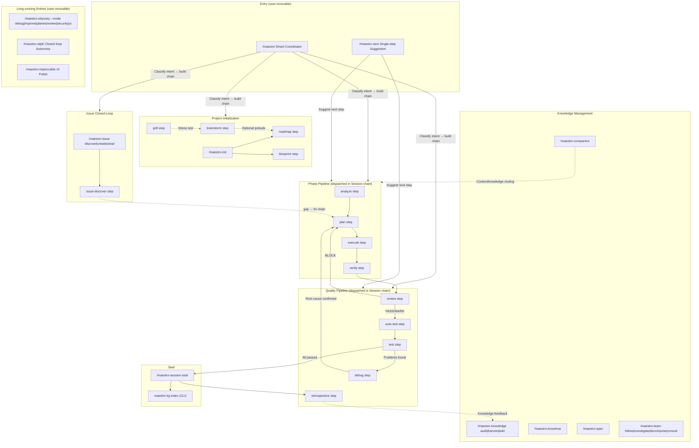

The Maestro command system exposes **18 slash commands**, plus first-tier steps dispatched by an orchestrator inside a Session chain, and directly-invocable `team-*` / `scholar-*` skills. This document provides the command panorama and core workflow navigation.

## Command Overview

| Category | Count | Commands | Responsibility |
|----------|-------|----------|----------------|
| **Core Orchestration** | 6 | `/maestro`, `/maestro-ralph`, `/maestro-next`, `/maestro-companion`, `/maestro-init`, `/maestro-session-seal` | Intent-to-chain planning, closed-loop policy, routing, lightweight execution, project init, Session seal |
| **Issues & Knowledge** | 4 | `/maestro-issue`, `/maestro-knowledge`, `/maestro-knowhow`, `/maestro-learn` | Issue lifecycle and discovery; knowledge-store audit/harvest/wiki/domain; knowhow capture; learning toolkit |
| **Specification** | 1 | `/maestro-spec` | Records constraint rules (init via `maestro spec init`, load via `maestro spec load`, remove via step `specs-remove`) |
| **Deep Cycle & UI** | 2 | `/maestro-odyssey`, `/maestro-impeccable` | Six-mode long-running iteration (debug/improve/planex/review/security/ui); UI design and codify |
| **Worktree** | 2 | `/maestro-fork`, `/maestro-merge` | Create and merge parallel-development worktrees |
| **System** | 3 | `/maestro-update`, `/maestro-overlay`, `/maestro-guard` | Self-update, command overlays, guard rules |

Beyond slash commands there are two other layers, neither invoked with a leading `/`:

- **First-tier steps** (`workflows/`) — `analyze`, `plan`, `execute`, `review`, `test`, `auto-test`, `debug`, `grill`, `brainstorm`, `blueprint`, `roadmap`, `harvest`, `retrospective`, `verify`, `collab` and others. They are dispatched by an orchestrator inside a Session chain; reach them through `/maestro "<intent>"` or `/maestro-next`, never by typing them as a `/maestro-…` slash command.
- **Skills** (`.claude/skills/`, of which 8 are `team-*`) — user-invocable team and utility skills such as `/team-swarm`; the `scholar-*` academic skill family is optional (选装, see below).

The global entry point `/maestro` is the **intent-to-chain planner**, which automatically selects the optimal command chain based on user intent and project state.

---

## Command Panorama



---

## Interaction Between Main Pipeline and Issues

```mermaid
graph TB
    subgraph phase_pipeline["Main Phase Pipeline"]
        direction LR
        AN["analyze"] -->|"Multiple"| AN
        AN --> PL["plan"] -->|"revise"| PL -->|"Execute one-by-one"| EX["execute"] --> VF["verify"]
        VF --> QR["review"] --> QBT["auto-test"] --> QT["test"] --> MA["session-seal"]
    end

    subgraph issue_loop["Issue Closed-Loop"]
        direction LR
        ID["discover"] --> IC["create"] --> IA["analyze --gaps"]
        IA --> IP["plan --gaps"] --> IE["execute"] --> ICL["close"]
    end

    subgraph shared["Shared Infrastructure"]
        JSONL[("issues.jsonl")]
        CMD["Commander Agent"]
        SCHED["ExecutionScheduler"]
        WS["WebSocket"]
    end

    QR -->|"Review finds problems, auto-create Issue"| IC
    QBT -->|"auto-test failure, Create Issue"| IC
    QT -->|"Test failure, Create Issue"| IC
    VF -->|"Verify gaps, produce Issue"| IC

    IC -->|"phase_id linkage, path=workflow"| phase_pipeline
    IE -->|"Fix code, serves Phase"| EX

    CMD -->|"Schedule Phase tasks"| SCHED
    CMD -->|"Auto-advance Issue"| IA
    CMD -->|"Auto-advance Issue"| IP

    IC --> JSONL
    IA --> JSONL
    IP --> JSONL
    IE --> JSONL
```



### Two Issue Processing Paths

| path | Meaning | Source | Lifecycle |
|------|---------|--------|-----------|
| `standalone` | Independent Issue, not bound to a Phase | Manual creation, `/maestro-issue discover`, external import | Independent closed-loop, does not affect Phase progression |
| `workflow` | Phase-linked Issue | `review` step auto-create, `auto-test` step failure, Phase verification output | May block milestone completion |

---

## 1. Main Workflow

### Project Initialization

```
/maestro-init → roadmap or blueprint (step, dispatched via /maestro)
```

| Step | Command / step | Purpose | Output |
|------|---------|---------|--------|
| 0 | `brainstorm` step (optional, via `/maestro`) | Multi-role brainstorming | guidance-specification.md |
| 1 | `/maestro-init` | Initialize .workflow/ directory | state.json, project.md, specs/ |
| 2a | `roadmap` step | Lightweight roadmap | roadmap.md |
| 2b | `blueprint` step | 6-stage specification blueprint | PRD + architecture docs + `.workflow/blueprint/` |

### Milestone Pipeline

```
analyze → plan → execute → verify → review → auto-test → test → session-seal
```

| Stage | Skill / Command | Output | Artifact |
|-------|---------|--------|----------|
| Analyze | `analyze` step | context.md, analysis.md | ANL-{NNN} |
| Plan | `plan` step | plan.json + TASK-*.json | PLN-{NNN} |
| Execute | `execute` step | .summaries/, code changes | EXC-{NNN} |
| Verify | `execute` built-in verification gate (E2.7) | verification.json | VRF-{NNN} |
| Seal | `/maestro-session-seal` | archived to milestones/ | — |

**Scope routing**: No args = entire milestone; number = specific milestone (micro mode); text = macro exploration (macro mode). `--dir` specifies upstream output path directly.

### Dual-Layer Analyze

| Layer | Argument | Purpose | Downstream Routing |
|-------|----------|---------|-------------------|
| **Macro** | text, e.g. `"user auth system"` | Requirement impact exploration, produces scope_verdict | large→roadmap, medium/small→plan |
| **Micro** | number, e.g. `1` | Milestone-level 6-dimension deep analysis | Directly to plan |

```bash
# analyze is a Session chain step, dispatched via /maestro or /maestro-next; the args below are chain args
# Macro: explore requirement impact before roadmap
analyze "Implement multi-tenancy"     # → scope_verdict: large → suggests roadmap

# Micro: Milestone-level deep analysis
analyze 1                              # → 6-dimension scoring → directly to plan

# Pass upstream context
analyze "Auth module" --from brainstorm:BRN-001
```

### Six Usage Modes

**A. Full milestone**: `analyze → plan → execute → verify` (one shot, all phases)

**B. Per-milestone**: `analyze 1 → plan 1 → execute 1` (each milestone independently, micro layer)

**C. Mixed**: Full analysis + per-phase execution + adhoc mid-stream

**D. Unified planning**: `analyze 1 → analyze 2 → plan → execute` (analyze first, plan once)

**E. Standalone**: `analyze "topic" → plan --dir → execute --dir` (no init/roadmap needed)

**F. Macro exploration**: `analyze "requirement"` → scope_verdict → roadmap or plan (macro layer, use before roadmap)

---

## 2. Quick Channel

```bash
/maestro-next "Fix login page bug"             # Pure router: classify intent → companion / single Run / /maestro

# Scratch mode (no init required; analyze/plan/execute are steps dispatched via /maestro)
analyze "Implement JWT auth"                   # scope=standalone
plan --dir scratch/20260420-analyze-xxx
execute --dir scratch/20260420-plan-xxx

# Lite chain (explore→plan→execute→test, built by the coordinator)
/maestro "Implement Issue system"
```

---

## 3. Issue Closed-Loop

```
Discover → Create → Analyze → Plan → Execute → Close
```

```bash
/maestro-issue discover by-prompt "Check API error handling"
/maestro-issue create --title "Memory leak" --severity high
analyze --gaps ISS-xxx                           # Root cause analysis (step)
plan --gaps                                      # Solution planning (step)
execute                                          # Execute fix (step)
/maestro-issue close ISS-xxx --resolution "Fixed"
```

**Commander Agent** auto-advances unanalyzed Issues with priority `execute > analyze > plan`.

---

## 4. Quality Pipeline

```bash
execute → review → auto-test → test → /maestro-session-seal
```

> Note: `auto-test` `review` `test` `debug` are first-tier steps dispatched by the orchestrator via the session chain — not directly invokable. Trigger them through `/maestro-next` or `/maestro "<intent>"`.

| Step / Command | Purpose | Key Parameters |
|---------|---------|----------------|
| `auto-test` step | Smart routing test (spec/gap/code) | `--re-run` `--dry-run` |
| `review` step | Tiered code review | `--level quick\|standard\|deep` |
| `test` step | Session-based UAT | `--auto-fix` |
| `debug` step | Hypothesis-driven debugging | `--from-uat {N}` `--parallel` |
| `/maestro-odyssey --mode improve` | Technical debt remediation | `[scope]` |

**Fix loop**: `verify gaps → plan --gaps → execute → verify` or `test failure → debug → plan --gaps → execute`

---

## 5. Coordinator Command Chains

```bash
/maestro "Implement user authentication module"  # Intent recognition → auto-select chain
/maestro -y "Add OAuth support"                  # Fully automatic mode
/maestro continue                                # Auto-execute next step
```

| Chain Name | Command Sequence | Use Case |
|------------|------------------|----------|
| `full-lifecycle` | init→blueprint→...→session-seal | Brand new project |
| `roadmap-driven` | init→roadmap→... | Lightweight roadmap |
| `brainstorm-driven` | brainstorm→init→roadmap→... | Start from brainstorming |
| `analyze-plan-execute` | analyze→plan→execute | Quick execution |
| `quality-loop` | review→test→debug | Quality pipeline |
| `milestone-close` | session-seal | Close a milestone |
| `companion` | instant small task (`/maestro-companion`) | Instant small tasks |

---

## 6. Specification and Knowledge

```bash
maestro spec init                                  # Seed skeleton spec files (no codebase scan)
maestro run skill specs-setup                      # Existing projects: scan the codebase
/maestro-spec coding "All APIs use Hono framework"  # Record a spec
maestro spec load --category coding                 # Load specs
maestro kg index                                   # Rebuild codebase docs
maestro search "authentication" --type knowhow     # Search knowhow
maestro session status                             # Project dashboard
```

---

## 7. Odyssey Series

Academic research and deep improvement workflows — 5 commands covering debugging, improvement, requirement implementation, code review, and UI optimization.

### Command Overview

| Command | Purpose | Core Flow |
|---------|---------|-----------|
| `/maestro-odyssey --mode debug` | Deep debugging closed-loop | Archaeology → Explore → Diagnose → Fix → Confirm → Generalize → Discover → Persist |
| `/maestro-odyssey --mode improve` | Codebase quality improvement | Survey → 6-dimension audit → Diagnose → Fix → Verify → Generalize → Discover → Persist |
| `/maestro-odyssey --mode planex` | Requirement-driven iterative delivery | Parse requirement → Acceptance criteria → Plan → Execute → Verify → Fix loop → Generalize |
| `/maestro-odyssey --mode review` | Deep code review + fix | Archaeology → Explore → Multi-dimension review → Exhaustive fix → Confirm → Generalize → Discover → Persist |
| `/maestro-odyssey --mode ui` | UI visual experience optimization | Survey → 6-dimension audit → Divergent exploration → Fix → Verify → Generalize → Discover → Persist |

### Common Traits

- **Zero-residual principle**: Every finding must have a concrete action (fix / create Issue / record decision) — no "report and shelve"
- **Phase auto-commit**: Automatic `git commit` after each phase, no user confirmation needed
- **Multi CLI assist**: Cross-validation via `maestro delegate` with multiple tools
- **Quality gate self-iteration**: Each analytical phase auto-evaluates coverage/depth/actionability, re-enters if insufficient (max 3 rounds)
- **Knowledge persistence**: S_RECORD phase writes reusable knowledge to understanding.md, later persisted via `/maestro-spec`
- **Session resumable**: `-c` flag resumes last session, `-y` auto-confirms all decision points

### `/maestro-odyssey --mode debug` — Deep Debugging

```bash
/maestro-odyssey --mode debug "Login API returns 500"                # Full debug loop
/maestro-odyssey --mode debug "Memory leak" --template memory-leak   # Predefined strategy
/maestro-odyssey --mode debug "Performance degradation" --skip-fix    # Analysis only
/maestro-odyssey --mode debug "Race condition" -y                     # Full auto mode
/maestro-odyssey --mode debug -c                                      # Resume last session
```

| Parameter | Description |
|-----------|-------------|
| `<issue>` | Issue description |
| `--template <name>` | Predefined strategy: `performance` / `memory-leak` / `race-condition` / `regression` / `crash` |
| `--skip-fix` | Analysis only, no fix execution |
| `--skip-generalize` | Skip generalization scan |
| `-y` | Auto-confirm all decisions (including delegate/agent confirmations; decisions recorded as `deferred`) |
| `-c` | Resume most recent session |

**Output**: `session.json` + `evidence.ndjson` + `explore.json` + `understanding.md` (9 sections)

### `/maestro-odyssey --mode improve` — Codebase Quality Improvement

```bash
/maestro-odyssey --mode improve src/auth/                            # Audit specific module
/maestro-odyssey --mode improve HEAD                                 # Audit recent changes
/maestro-odyssey --mode improve --dimensions performance,security    # Specify dimensions
/maestro-odyssey --mode improve --all --skip-fix                     # Full project scan, review only
```

| Parameter | Description |
|-----------|-------------|
| `<target>` | Module path / `HEAD` / `staged` / keyword / `--all` |
| `--dimensions <list>` | 6-dimension subset: `performance` / `security` / `architecture` / `reliability` / `observability` / `maintainability` |
| `--fix-threshold <severity>` | Fix threshold: `all` / `critical` / `high` / `medium` / `low` |
| `--skip-fix` | Audit + diagnose only |
| `--skip-generalize` | Skip generalization |

**6 dimensions**: Performance (hot paths, N+1 queries), Security (OWASP Top 10), Architecture (layer violations, circular deps), Reliability (error handling), Observability (logging coverage), Maintainability (complexity, dead code)

### `/maestro-odyssey --mode planex` — Requirement-Driven Iterative Delivery

```bash
/maestro-odyssey --mode planex "Implement JWT authentication"         # Full requirement loop
/maestro-odyssey --mode planex "Fix login bug" --template bugfix      # Bug fix template
/maestro-odyssey --mode planex "Refactor API layer" --template refactor  # Refactor template
/maestro-odyssey --mode planex "Implement payments" --max-iterations 5   # Max 5 verify cycles
/maestro-odyssey --mode planex "Migrate DB" --method cli --executor codex  # CLI execution
```

| Parameter | Description |
|-----------|-------------|
| `<requirement>` | Requirement description |
| `--template <name>` | Template: `feature` / `bugfix` / `refactor` / `migration` / `api-endpoint` |
| `--max-iterations N` | Max verify→fix cycles (default 3) |
| `--method agent\|cli\|auto` | Execution method |
| `--executor <tool>` | Explicit CLI executor tool |
| `--skip-verify` | Skip post-execution validation gate |

**Core loop**: Define acceptance criteria → Plan → Execute → Verify each criterion → Fix failures → Re-verify until all pass

### `/maestro-odyssey --mode review` — Deep Code Review

```bash
/maestro-odyssey --mode review src/api/                     # Review specific directory
/maestro-odyssey --mode review HEAD                         # Review recent changes
/maestro-odyssey --mode review --dimensions correctness,security  # Specify dimensions
/maestro-odyssey --mode review --fix-threshold high         # Only fix critical + high
```

| Parameter | Description |
|-----------|-------------|
| `<target>` | File/dir path / `HEAD` / `staged` / Phase number / PR number |
| `--dimensions <list>` | Dimension subset: `correctness` / `security` / `performance` / `architecture` |
| `--fix-threshold <severity>` | Fix threshold (default `all` = exhaustive) |
| `--skip-fix` | Review only |
| `--skip-generalize` | Skip generalization |

**Exhaustive fix**: Per severity tier (critical → high → medium → low), re-review modified area after each tier

### `/maestro-odyssey --mode ui` — UI Visual Experience Optimization

```bash
/maestro-odyssey --mode ui src/components/Header/                    # Audit specific component
/maestro-odyssey --mode ui --dimensions visual_hierarchy,accessibility  # Specify dimensions
/maestro-odyssey --mode ui --skip-fix                                # Review + divergent exploration only
```

| Parameter | Description |
|-----------|-------------|
| `<target>` | Component/page path / `staged` / `HEAD` / feature area name |
| `--dimensions <list>` | 6-dimension subset: `visual_hierarchy` / `interaction_states` / `accessibility` / `responsiveness` / `micro_interactions` / `edge_cases` |
| `--skip-fix` | Review only |
| `--skip-generalize` | Skip generalization |

**Unique phase**: S_DIVERGE (Divergent exploration) — Goes beyond defect fixing to ask "what would make this delightful?"

---

## 8. Ralph Lifecycle Engine

Ralph is the adaptive lifecycle engine that reads project state → infers position → builds adaptive step chains → delegates execution.

### `/maestro-ralph` — Adaptive Decision Engine

```bash
/maestro-ralph "Implement user authentication"        # Auto-infer position and build chain
/maestro-ralph "phase 2"                              # Specify phase
/maestro-ralph status                                 # View current session status
/maestro-ralph continue                               # Resume execution
/maestro-ralph -y "Refactor API layer"                # Full auto mode
```

**Core invariants**:
- Session/Run/Artifact/Evidence protocol files are the only authority
- Ralph policy owns proposal disposition, budgets, confidence, escalation, and stop conditions
- `run-executor` executes exactly one Skill Run and never completes or advances the chain
- Skills may only emit typed proposals; the Runtime owns mutation authority

**Decision gates**: post-execute / post-business-test / post-review / post-test / post-goal-audit / post-analyze-scope / post-milestone — auto-evaluates quality gate results, decides proceed / fix / escalate

### `run-executor` — Generic Single-Run Executor

```bash
maestro run next --session <session-id>               # Allocate the next chain Run
maestro run brief <run-id> --session <session-id>     # Load the canonical Resume Packet
```

`run-executor` performs `run next/brief` → one inline Skill → `run check` → returns Artifacts and an optional proposal. The outer `/maestro-ralph` policy evaluates the proposal and completes through `maestro run complete --verdict [--chain-proposal]`; only another explicit `run next` allocates a later Run.

---

## 9. Additional maestro-* Commands

### `/maestro-overlay --amend` — Workflow Deficiency Fix

```bash
/maestro-overlay --amend --scan                                 # Auto-scan .workflow/ for signals
/maestro-overlay --amend --from-verify .workflow/scratch/xxx    # Collect from verification results
/maestro-overlay --amend --from-review .workflow/scratch/xxx    # Collect from code review
/maestro-overlay --amend --from-issues ISS-001,ISS-002          # Collect from Issues
/maestro-overlay --amend "Missing verification after execute"   # Direct description
```

Signal-driven overlay generator — collects workflow deficiency signals from multiple sources, diagnoses which commands need amendment, batch-generates targeted overlays. Unlike `/maestro-overlay` (single explicit intent), this command **discovers** what needs amending. (To change a Session's goal instead, use `/maestro-ralph`.)

### `collab` step — Multi-Tool Cross-Verification

`collab` is a Session chain step, dispatched via `/maestro` (chain form `{"command": "collab", "args": "..."}`); the args below are chain args:

```bash
collab "Evaluate microservice decomposition"  # Multi-tool parallel analysis
collab "Review security architecture" --tools gemini,claude  # Specify tools
collab "API design review" --mode analysis    # Read-only analysis mode
```

Fans out requirement to multiple CLI tools in parallel → cross-verifies for consensus/conflicts → synthesizes unified report (collab-report.md + context.md + conclusions.json).

### `/maestro-fork` — Milestone Worktree Parallel Dev

```bash
/maestro-fork -m 2                                    # Create worktree for Milestone 2
/maestro-fork -m 2 --base develop                     # Specify base branch
/maestro-fork -m 2 --sync                             # Sync latest main changes
```

Creates or syncs a milestone-level git worktree for parallel development. Auto-copies shared `.workflow/` files, writes scope marker and scoped state.json.

### `/maestro-merge` — Milestone Worktree Merge

```bash
/maestro-merge -m 2                                   # Merge Milestone 2 worktree
/maestro-merge -m 2 --dry-run                         # Preview merge
/maestro-merge -m 2 --no-cleanup                      # Merge but keep worktree
/maestro-merge -m 2 --continue                        # Continue after conflict resolution
```

Merges a milestone worktree branch back into main, syncs scratch artifacts, reconciles artifact registry. Two-phase: git merge first, artifact sync second.

### `/maestro-guard` — Editing Boundary Management

```bash
/maestro-guard on                                     # Enable boundary protection
/maestro-guard off                                    # Disable
/maestro-guard status                                 # View status
/maestro-guard allow src/                             # Allow editing src/ directory
/maestro-guard deny node_modules/                     # Deny editing node_modules/
```

Configures directory-level write boundaries enforced by the `workflow-guard` PreToolUse hook.

### `/maestro-overlay` — Command Overlay Creation

```bash
/maestro-overlay "Always run review after execute"     # Create overlay from natural language
/maestro-overlay "Load domain knowledge before analyze"  # Inject required_reading
```

Turns natural-language instructions into command overlays — JSON patch files that augment `.claude/commands/*.md` non-invasively. Supports injection point preview, skill chain configuration, idempotent installation. Management via `maestro overlay list` (ink TUI).

### `/maestro-impeccable --codify` — Design System Extraction

```bash
/maestro-impeccable --codify src/components/                    # Extract design system from source
/maestro-impeccable --codify src/ --package-name my-design      # Specify package name
/maestro-impeccable --codify src/ --output-dir .workflow/ref    # Specify output directory
```

4-phase pipeline: Validate → Extract (3 parallel Agents) → Package (preview.html) → Knowhow persistence. Outputs design-tokens.json + layout-templates.json + preview + knowhow manifest.

### `/maestro-update` — Version Upgrade

```bash
/maestro-update                                       # Detect and upgrade
/maestro-update --dry-run                             # Preview upgrade plan
/maestro-update --force                               # Skip confirmation
/maestro-update --setup-only                          # Run only current version setup
```

Detects current version → runs schema migration → executes version-specific upgrade workflow. Auto-backs up state.json, supports incremental migration.

---

## 10. CLI Subsystems

### `maestro install toggle` — Command Enable/Disable

```bash
maestro install toggle                                # Interactive TUI
maestro install toggle --type command                  # Manage commands only
maestro install toggle --list                         # List all installed items
maestro install toggle --enable "maestro-ralph,maestro-search"   # Enable specified
maestro install toggle --disable "team-swarm,team-review"        # Disable specified
```

Provides both interactive TUI and non-interactive CLI to manage enabled state of installed commands, skills, and agents.

### `maestro workspace` — Workspace Management

```bash
maestro workspace link <path>                         # Link external workspace
maestro workspace unlink <path>                       # Unlink
maestro workspace list                                # List all linked workspaces
maestro workspace status                              # View workspace status
```

Manages multi-project workspace links, supporting cross-project knowledge sharing and artifact references.

### `maestro domain` — Domain Knowledge Management

```bash
maestro domain                                        # View current domain config
```

Manages project domain knowledge configuration, affecting spec injection and knowledge search scope.

### `/maestro-knowledge extractors` — Knowledge Graph Extractor Config

```bash
/maestro-knowledge extractors                                 # Scan and generate extraction rules
/maestro-knowledge extractors --scan-only                     # Scan only, no write
/maestro-knowledge extractors --append                        # Append to existing config
/maestro-knowledge extractors --language typescript            # Limit to specific language
```

Analyzes codebase patterns to auto-generate `.workflow/kg/extractors.yaml` — teaches MaestroGraph's codegraph extractor to recognize project-specific symbols (builder/factory APIs, domain constants, custom decorators, etc.). 3 parallel agents scan builder/factory calls, constants/annotations, and framework-specific patterns.

### `store_knowhow` MCP Tool

`store_knowhow` is a built-in MCP tool for knowledge entry storage and search:

| Operation | Description |
|-----------|-------------|
| `add` | Create new knowhow entry (type: session/tip/template/recipe/reference/decision/asset/blueprint/document) |
| `search` | Full-text search knowhow entries |

Entries are auto-indexed by WikiIndexer (type=knowhow, category={type}). Supports tags, categorization, and spec category bridging (`specCategory` parameter allows knowhow entries to be injected alongside spec entries).

---

## 11. Scholar Skills (Optional)

10 academic research skills covering the full pipeline from ideation to publication. **Optional (not installed by default)**: sources live in `optional/skills/`, absent from default mirrors and `.claude/skills/`. Install on demand:

```bash
maestro install toggle --enable scholar-writing,scholar-review   # install into the current project
maestro install toggle --list                                     # list available optional skills
```

| Skill | Purpose | Trigger Words |
|-------|---------|---------------|
| `scholar-ideation` | Research ideation & literature review | brainstorm research ideas, identify research gaps |
| `scholar-experiment` | Experimental results analysis | analyze experimental results, statistical analysis |
| `scholar-writing` | End-to-end paper writing | write paper, draft paper |
| `scholar-review` | Paper self-review & reviewer response | review paper, write rebuttal |
| `scholar-rebuttal-pro` | Enhanced reviewer response (multi-perspective) | rebuttal, respond to reviewers |
| `scholar-citation-verify` | Citation verification (4-layer) | verify citations, check references |
| `scholar-anti-ai-writing` | Remove AI writing patterns | remove AI patterns, humanize text |
| `scholar-latex-organizer` | LaTeX template organization | organize LaTeX template, prepare Overleaf |
| `scholar-publish` | Post-acceptance conference preparation | conference preparation, prepare presentation |
| `scholar-thesis-docx` | Thesis/dissertation Word formatting | thesis formatting, dissertation Word |

---

## Specialized Guides

| Topic | Guide |
|-------|-------|
| Quality pipeline details | [Quality Pipeline Guide](./quality-pipeline-guide.md) |
| Issue discovery & closed-loop | [Issue Discover Guide](./issue-discover-guide.md) |
| Learning toolkit | [Learn Tools Guide](./learn-tools-guide.md) |
| Knowledge graph management | [Knowledge Management Guide](./knowledge-management-guide.md) |
| Search system | [Search System Guide](./search-system-guide.md) |
| Installation guide | [Install Guide](./install-guide.md) |
| CLI command reference | [CLI Commands Guide](./cli-commands-guide.md) |
| Spec system | [Spec System Guide](./spec-system-guide.md) |
| Spec injection mechanism | [Spec Injection Guide](./spec-injection-guide.md) |
| MCP tools reference | [MCP Tools Guide](./mcp-tools-guide.md) |
| Delegate async tasks | [Delegate Async Guide](./delegate-async-guide.md) |
| Overlay command extension | [Overlay Guide](./overlay-guide.md) |
| Hooks automation | [Hooks Guide](./hooks-guide.md) |
